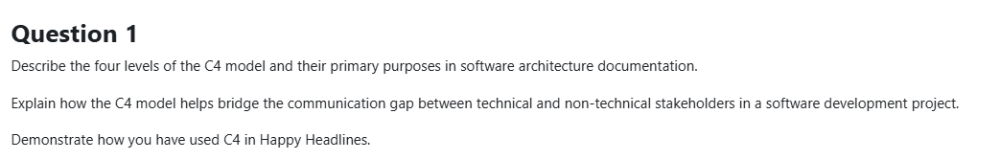

# Question 1: C4 Model

## Part 1: The Four Levels of C4 Model

### Level 1: System Context
**Purpose:** Show the big picture - your system and how it fits in the world

**What it shows:**
- Your system (as a single box)
- External users (people)
- External systems (other software)
- Relationships between them

**Audience:** Everyone (execs, business, developers)

**Example:** "HappyHeadlines system used by Readers and Publishers, connects to external RabbitMQ"

---

### Level 2: Container
**Purpose:** Show the high-level technical building blocks

**What it shows:**
- Major applications/services
- Databases
- Message brokers
- How they communicate

**Audience:** Technical stakeholders (architects, leads, ops)

**Example:** ArticleService, CommentService, Redis, SQL databases, RabbitMQ

**Note:** "Container" here means deployable unit (service, database), NOT Docker container

---

### Level 3: Component
**Purpose:** Show the internal structure of one container

**What it shows:**
- Major classes/modules within a service
- Controllers, Services, Repositories
- Internal relationships

**Audience:** Developers working on that service

**Example:** Inside ArticleService: ArticleController → ArticleAppService → ArticleRepository

---

### Level 4: Code
**Purpose:** Show actual implementation details

**What it shows:**
- Class diagrams
- Actual code structure
- UML diagrams

**Audience:** Developers implementing features

**Example:** ArticleAppService class with methods, properties, dependencies

**Note:** Usually the IDE/code itself is better than diagrams at this level

---

## Part 2: Bridging Communication Gaps

### The Problem
- **Non-technical stakeholders** need to understand the system but get lost in technical details
- **Technical stakeholders** need precision but high-level overviews miss important details
- **One diagram can't satisfy everyone**

### How C4 Solves It

#### Zoom Levels for Different Audiences

**CEO/Business (Context):**
- Sees: "HappyHeadlines processes articles and comments"
- Understands: What the system does, who uses it
- Doesn't see: Implementation details, technologies

**Project Manager/Architect (Container):**
- Sees: Services, databases, message queues
- Understands: System architecture, deployment units
- Can discuss: Scalability, reliability, infrastructure

**Developers (Component):**
- Sees: Internal structure of services
- Understands: Code organization, dependencies
- Can discuss: Feature implementation, refactoring

**Progressive Disclosure:**
1. Start with Context (simple)
2. Zoom into Container (more detail)
3. Zoom into Component (implementation)
4. Zoom into Code (if needed)

Each level adds detail without overwhelming anyone.

---

## Part 3: C4 in HappyHeadlines

### Level 1: System Context Diagram

```
┌──────────────────────────────────────┐
│                                      │
│       HappyHeadlines System          │
│  (News article aggregation platform) │
│                                      │
└──────────────────────────────────────┘
          ↑              ↑
          │              │
     [Reader]      [Publisher]
          │              │
          │              ↓
          │       Publishes articles
          │              
    Reads articles & comments
```

**What this shows:**
- The system as a black box
- Two types of users: Readers and Publishers
- What each user does

**Stakeholder value:** Business understands who uses the system and why

---

### Level 2: Container Diagram

```
┌─────────────────────────────────────────────┐
│          HappyHeadlines System              │
│                                             │
│  ┌──────────────┐      ┌───────────────┐   │
│  │Publisher     │      │Article        │   │
│  │Service       │─────→│Service        │   │
│  └──────────────┘      └───────────────┘   │
│         │                      │            │
│         │                      ↓            │
│         │              ┌───────────────┐    │
│         ↓              │8 Regional     │    │
│  ┌──────────────┐      │SQL Databases  │    │
│  │RabbitMQ      │      └───────────────┘    │
│  │(Message Bus) │              ↑            │
│  └──────────────┘              │            │
│         │                      │            │
│         ↓                      │            │
│  ┌──────────────┐      ┌───────────────┐   │
│  │Comment       │      │Redis Cache    │   │
│  │Service       │──────→               │   │
│  └──────────────┘      └───────────────┘   │
│         │                                   │
│         ↓                                   │
│  ┌──────────────┐      ┌───────────────┐   │
│  │Profanity     │      │Comment        │   │
│  │Service       │      │SQL Database   │   │
│  └──────────────┘      └───────────────┘   │
│                                             │
└─────────────────────────────────────────────┘
```

**What this shows:**
- Major services: PublisherService, ArticleService, CommentService, ProfanityService
- Data stores: Redis, SQL databases
- Message infrastructure: RabbitMQ
- Communication flows

**Stakeholder value:**
- Architects see the overall architecture
- Ops understands what needs to be deployed
- Developers see service boundaries

**Key architectural decisions visible:**
- Y-axis scaling (microservices)
- Z-axis scaling (regional databases)
- Async communication (RabbitMQ)
- Caching strategy (Redis)

---

### Level 3: Component Diagram (ArticleService)

```
┌─────────────────── ArticleService ────────────────────┐
│                                                        │
│  ┌─────────────────┐                                  │
│  │ArticleController│ ← HTTP Requests                  │
│  └────────┬────────┘                                  │
│           │                                            │
│           ↓                                            │
│  ┌─────────────────┐      ┌──────────────────┐       │
│  │ArticleAppService│─────→│ICompressionService│       │
│  └────────┬────────┘      └──────────────────┘       │
│           │                                            │
│           ↓                                            │
│  ┌─────────────────┐                                  │
│  │IArticleRepository│                                 │
│  └────────┬────────┘                                  │
│           │                                            │
│           ↓                                            │
│  ┌─────────────────┐                                  │
│  │ArticleDbContext │                                  │
│  └─────────────────┘                                  │
│                                                        │
│  Background Services:                                 │
│  ┌──────────────────────┐                             │
│  │ArticleConsumer       │ ← RabbitMQ                  │
│  └──────────────────────┘                             │
│  ┌──────────────────────┐                             │
│  │ArticleCacheCommander │ ← Cache warming             │
│  └──────────────────────┘                             │
│                                                        │
└────────────────────────────────────────────────────────┘
```

**What this shows:**
- Request flow: Controller → AppService → Repository → DbContext
- Separation of concerns (MVC pattern)
- Compression service for green architecture
- Background workers for async processing

**Stakeholder value:**
- Developers understand code organization
- Can identify where to add features
- See layered architecture pattern

**Key design patterns visible:**
- Dependency injection (interfaces)
- Repository pattern
- Service layer
- Background services

---

### Level 4: Code (Example - ArticleAppService)

```csharp
public class ArticleAppService : IArticleAppService
{
    private readonly IArticleRepository _repo;
    private readonly IDistributedCache _cache;
    private readonly IMemoryCache _memoryCache;
    private readonly ICompressionService _compression;
    
    // Three-tier caching: Memory → Redis → Database
    public async Task<Article?> GetArticleAsync(int id, string region)
    {
        // L1: Memory cache (0 hops)
        if (_memoryCache.TryGetValue(key, out Article? cached))
            return cached;
        
        // L2: Redis cache (1 hop, compressed)
        var bytes = await _cache.GetAsync(key);
        if (bytes != null)
            return Decompress(bytes);
        
        // L3: Database (2+ hops)
        return await _repo.GetArticleById(id, region);
    }
}
```

**What this shows:**
- Actual implementation
- Caching strategy in code
- Dependencies

**Stakeholder value:**
- Developers implementing features
- Code reviews
- Understanding implementation details

---

## Summary: How C4 Bridges the Gap

### Traditional Problem:
One diagram for everyone → Too complex for business OR too simple for developers

### C4 Solution:
Four levels of abstraction → Each stakeholder gets the right level of detail

| Stakeholder | C4 Level | What They See | What They Can Do |
|-------------|----------|---------------|------------------|
| CEO/Business | Context | System purpose, users | Make business decisions |
| Project Manager | Container | Services, databases | Plan deployments, resources |
| Tech Lead | Container + Component | Architecture + structure | Design features |
| Developer | Component + Code | Implementation | Write code |

**Key benefit:** Same system, different perspectives, everyone understands what they need to understand.

In HappyHeadlines:
- Context shows the news platform concept
- Container shows microservices architecture
- Component shows internal service structure
- Code shows implementation (caching, compression, etc.)

Each level builds on the previous, creating a complete picture without overwhelming anyone.

