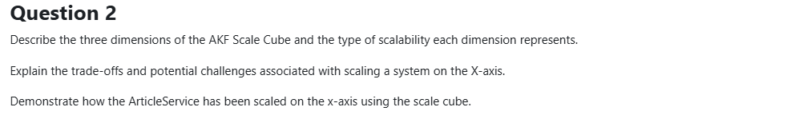

# Question 2: AKF Scale Cube

## Part 1: The Three Dimensions

### X-Axis: Horizontal Duplication (Cloning)

**What it is:** Running multiple identical copies of your application

**Type of scalability:** Horizontal scaling through replication

**How it works:**
- Clone the entire application
- Put copies behind a load balancer
- Each instance handles part of the traffic
- All instances run the same code

**Example:** 3 identical ArticleService instances processing requests

**Key characteristic:** Same code, same functionality, different machines

---

### Y-Axis: Functional Decomposition (Microservices)

**What it is:** Splitting application by function/feature/domain

**Type of scalability:** Functional scaling through separation of concerns

**How it works:**
- Break monolith into specialized services
- Each service handles one domain/feature
- Services communicate via APIs or messages
- Different codebases, different responsibilities

**Example:** ArticleService, CommentService, ProfanityService (each does one thing)

**Key characteristic:** Different responsibilities, independent deployment

---

### Z-Axis: Data Partitioning (Sharding)

**What it is:** Splitting data by some criteria

**Type of scalability:** Data scaling through segmentation

**How it works:**
- Partition data based on attribute (geography, customer ID, tenant)
- Each partition has its own database
- Route requests to correct partition
- Same code, different data subsets

**Example:** 8 regional article databases (Europe, Asia, Africa, etc.)

**Key characteristic:** Same application, different data

---

## Part 2: X-Axis Scaling Trade-offs & Challenges

### Benefits ✅

**1. Simple to implement**
- Just spin up more instances
- No code changes required
- Works with existing application

**2. Increased capacity**
- More instances = more concurrent requests
- Near-linear scaling (2x instances ≈ 2x throughput)

**3. High availability**
- If one instance fails, others keep serving
- Rolling updates possible (zero downtime)

**4. Load distribution**
- Load balancer spreads traffic evenly
- No single instance overwhelmed

---

### Trade-offs ⚖️

**1. Shared resource bottlenecks**
- All instances share database → Database becomes bottleneck
- All instances share message queue → Queue becomes bottleneck
- Solution: Eventually need Y or Z-axis scaling

**2. Data consistency challenges**
- Cache invalidation across instances is complex
- Each instance may have different cached data
- Need distributed cache (Redis) or cache invalidation strategy

**3. Linear cost increase**
- 3x instances = 3x infrastructure cost
- May not be cost-effective at scale
- Eventually, need smarter scaling (Y or Z-axis)

**4. Diminishing returns**
- After certain point, adding instances doesn't help much
- Shared resources become saturated
- Example: 10 instances all waiting on same database

---

### Challenges 🚧

**1. Stateless requirement**
- Services must be stateless
- Can't store user sessions in memory
- Need external state storage (Redis, database)

**Example in HappyHeadlines:**
```csharp
// BAD: State in memory
private static Dictionary<int, Article> _cache = new();

// GOOD: External state
private readonly IDistributedCache _cache; // Redis
```

**2. Configuration synchronization**
- All instances need identical configuration
- Environment variables, secrets, connection strings
- If one instance has wrong config → inconsistent behavior

**3. Cache coherence**
- Instance A caches article
- Article updated in database
- Instance B serves stale cached data
- **Solution:** Distributed cache with TTL or invalidation events

**4. Connection pool management**
- Each instance creates DB connections
- 10 instances × 20 connections = 200 DB connections
- Database connection limit easily reached
- **Solution:** Connection pooling, smaller pool per instance

**5. Deployment complexity**
- Need orchestration (Docker Swarm, Kubernetes)
- Health checks to know when instance is ready
- Rolling updates to avoid downtime
- Load balancer configuration

**6. Debugging difficulty**
- Request might hit different instance each time
- Logs scattered across instances
- Need centralized logging (Seq, ELK)
- Tracing becomes essential (Zipkin)

---

## Part 3: ArticleService X-Axis Scaling Demonstration

### Architecture

```
                    Load Balancer (Docker Swarm)
                            |
        ┌───────────────────┼───────────────────┐
        ↓                   ↓                   ↓
ArticleService-1    ArticleService-2    ArticleService-3  ← X-axis: 3 replicas
        |                   |                   |
        └───────────────────┼───────────────────┘
                            ↓
                  Shared Infrastructure
                            |
        ┌───────────────────┼───────────────────┐
        ↓                   ↓                   ↓
    RabbitMQ           Redis Cache        Regional DBs
                                          (Z-axis: 8 regions)
```

### Implementation: docker-compose.swarm.yml

```yaml
services:
  article-service:
    image: articleservice:latest
    deploy:
      replicas: 3  # ← X-axis scaling: 3 identical instances
      update_config:
        parallelism: 1     # Update one at a time
        delay: 10s         # Wait 10s between updates
      restart_policy:
        condition: on-failure
    networks:
      - HHL
```

**How it works:**
- Docker Swarm creates 3 identical containers
- Built-in load balancer distributes requests
- Each instance runs same code
- Rolling updates ensure zero downtime

---

### How Requests are Handled

**Example: User requests article with ID 42**

```
1. Request arrives at Swarm load balancer
2. Load balancer routes to ArticleService-2 (round-robin)
3. ArticleService-2 checks:
   a. Memory cache (L1) → Miss
   b. Redis cache (L2) → Hit!
4. Return article from Redis
5. Next request for same article might go to ArticleService-1
6. ArticleService-1 has different L1 cache → Redis hit
```

**Key observation:** Shared L2 cache (Redis) ensures consistency across instances

---

### Stateless Design

**All state externalized:**

```csharp
// Program.cs - ArticleService
builder.Services.AddMemoryCache(options =>
{
    options.SizeLimit = 100;  // Each instance: independent L1 cache
});

builder.Services.AddStackExchangeRedisCache(options =>
{
    options.Configuration = "redis:6379";  // Shared L2 cache
});

builder.Services.AddDbContext<ArticleDbContext>();  // Shared database
```

**Why this works:**
- L1 (Memory): Fast but instance-local → Can differ between instances
- L2 (Redis): Shared across all instances → Consistency
- L3 (Database): Shared → Authoritative source

---

### Handling Challenges

**Challenge 1: Cache coherence**

**Problem:** Article updated, but cached in multiple instances

**Solution:** Short TTL + Distributed cache
```csharp
// L1: 5 minute TTL (local inconsistency acceptable)
_memoryCache.Set(key, article, TimeSpan.FromMinutes(5));

// L2: 14 day TTL (shared, consistent)
await _cache.SetAsync(key, compressed, TimeSpan.FromDays(14));
```

After 5 minutes, all instances refresh from Redis.

---

**Challenge 2: Connection pooling**

**Problem:** 3 instances × 20 connections = 60 database connections

**Solution:** Connection pooling configuration
```csharp
options.UseSqlServer(connectionString, sql =>
{
    sql.EnableRetryOnFailure(
        maxRetryCount: 5,
        maxRetryDelay: TimeSpan.FromSeconds(10)
    );
});
```

Entity Framework manages pool efficiently.

---

**Challenge 3: Message consumption**

**Problem:** RabbitMQ messages consumed by random instance

**Solution:** Each instance consumes from same queue
```csharp
// ArticleConsumer.cs - runs in each instance
await _channel.QueueDeclareAsync("articles.persist.queue", durable: true);
await _channel.BasicConsumeAsync("articles.persist.queue", autoAck: false, consumer);
```

RabbitMQ ensures each message delivered to exactly one instance.

---

### Observability Across Instances

**Centralized logging:**
```csharp
// All instances send logs to Seq
MonitorService.ConfigureSerilog(config =>
{
    config.WriteTo.Seq("http://seq:80");  // Centralized
    config.Enrich.WithProperty("ServiceName", "ArticleService");
    config.Enrich.WithProperty("InstanceId", Environment.MachineName);  // Track which instance
});
```

**In Seq:** Filter by `InstanceId` to debug specific instance

**Distributed tracing:**
- Zipkin tracks requests across instances
- Same trace ID follows request through ArticleService-1 → RabbitMQ → ArticleService-2

---

### Benefits Realized

**1. High availability**
- If ArticleService-2 crashes, Swarm restarts it
- ArticleService-1 and ArticleService-3 continue serving
- Users don't notice

**2. Increased throughput**
- Single instance: ~1000 req/s
- Three instances: ~2800 req/s (some overhead)

**3. Rolling updates**
```bash
docker service update --image articleservice:v2 article-service
```
- Updates one instance at a time
- Waits 10s between updates
- Zero downtime

**4. Load distribution**
- Round-robin balancing
- No single instance overwhelmed
- Automatic failover if instance unhealthy

---

### Summary

**X-axis scaling in ArticleService:**
- ✅ 3 identical replicas via Docker Swarm
- ✅ Stateless design (external Redis, DB)
- ✅ Shared infrastructure (RabbitMQ, Redis, regional DBs)
- ✅ Centralized logging and tracing
- ✅ Rolling updates for zero downtime

**Result:** 3x capacity with simple configuration, resilient to single-instance failures.

