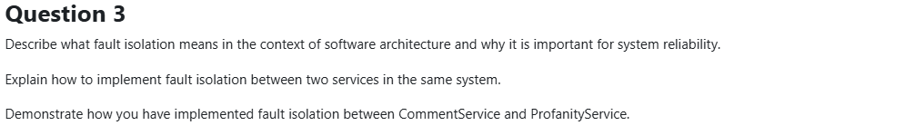

# Question 3: Fault Isolation

## Part 1: What is Fault Isolation and Why is it Important?

### What is Fault Isolation?

**Definition:** Preventing failures in one service from cascading to other services.

Think of it like watertight compartments on a ship - if one floods, the others stay dry.

### The Problem: Cascading Failures

**Without fault isolation:**
```
ProfanityService crashes
    ↓
CommentService HTTP call hangs (30s timeout)
    ↓
All CommentService threads blocked
    ↓
CommentService stops responding
    ↓
Users can't post OR read comments
    ↓
ENTIRE FEATURE DOWN
```

One small failure takes down everything.

### The Solution: Isolation

**With fault isolation:**
```
ProfanityService crashes
    ↓
Circuit breaker detects failure (3 attempts)
    ↓
Circuit opens → Fast-fail future requests
    ↓
Fallback: Block new comments temporarily
    ↓
Users CAN still read existing comments
    ↓
DEGRADED BUT OPERATIONAL
    ↓
Auto-recovers when ProfanityService returns
```

---

### Why It's Important

**1. Failures are inevitable**

In microservices, you're dealing with:
- Network failures
- Service crashes
- Database timeouts
- API rate limits
- Resource exhaustion

**Reality:** With 10 services, something is always broken.

---

**2. Small failures can cascade**

Without isolation:
- 1 slow service → All calling services slow
- 1 service crash → Dependent services crash
- 1% of system failing → 100% of features broken

---

**3. Graceful degradation vs complete outage**

Better to have limited functionality than nothing at all:

| When ProfanityService Down | Without Isolation | With Isolation |
|----------------------------|-------------------|----------------|
| Can read comments? | ❌ No | ✅ Yes |
| Can post comments? | ❌ No | ❌ No (temporarily) |
| User sees | "Error 500" | "Posting disabled" |
| Recovery | Manual restart | Automatic |

**Key insight:** Degraded experience > Broken experience

---

**4. Independent operations**

Fault isolation enables:
- Deploy services independently
- Scale services independently
- One service fails, others continue
- System self-heals automatically

---

## Part 2: How to Implement Fault Isolation

### Technique 1: Circuit Breaker Pattern 🔴

**What it does:** Automatically stops calling a failing service

**Three states:**
- **Closed** (Normal): Requests go through
- **Open** (Failing): Fast-fail, no calls made
- **Half-Open** (Testing): Try one request to see if recovered

**Implementation:**
```csharp
var circuitBreaker = Policy
    .Handle<HttpRequestException>()
    .CircuitBreakerAsync(
        handledEventsAllowedBeforeBreaking: 3,  // Open after 3 failures
        durationOfBreak: TimeSpan.FromSeconds(30)  // Stay open 30s
    );
```

**How it works:**
1. Call fails 3 times → Circuit opens
2. For next 30s → All calls fail immediately (no HTTP)
3. After 30s → Circuit half-opens, try one request
4. Success → Close circuit | Failure → Stay open

**Benefit:** Prevents thread exhaustion from hanging calls

---

### Technique 2: Fallback Strategy 🛡️

**What it does:** Defines what to do when circuit is open

**Implementation:**
```csharp
var fallback = Policy<ProfanityCheckResult>
    .Handle<HttpRequestException>()
    .FallbackAsync(
        fallbackValue: new ProfanityCheckResult(isProfane: true, serviceUnavailable: true)
    );
```

**Strategies:**
- **Fail-closed:** Block all when service down (safe for profanity)
- **Fail-open:** Allow all when service down (risky)
- **Cached response:** Use last known good data
- **Queue for later:** Process when service recovers

---

### Technique 3: HTTP Timeouts ⏱️

**What it does:** Prevents waiting forever

**Implementation:**
```csharp
builder.Services.AddHttpClient("ProfanityService", client =>
{
    client.Timeout = TimeSpan.FromSeconds(10);
});
```

**Why it matters:**
- Without: Thread blocks 30s+ waiting for dead service
- With: Fail after 10s, circuit breaker counts failure

---

### Technique 4: Retry with Backoff 🔁

**What it does:** Handles temporary glitches

**Implementation:**
```csharp
.WaitAndRetryAsync(
    retryCount: 5,
    sleepDurationProvider: attempt => TimeSpan.FromSeconds(Math.Pow(2, attempt))
    // 2s, 4s, 8s, 16s, 32s
);
```

**Why exponential backoff?**
- Gives service time to recover
- Doesn't hammer struggling service
- Increases chance of success

---

### Technique 5: Async Messaging 📨

**What it does:** Decouples services via queue

**Implementation:**
```csharp
// PublisherService
await _channel.BasicPublishAsync("articles.exchange", ...);
// Returns immediately, doesn't wait for ArticleService
```

**Benefits:**
- Publisher doesn't wait for consumer
- If consumer down, messages queue in RabbitMQ
- Temporal decoupling (services don't need to be online simultaneously)

---

### Combining Techniques

**Best practice:** Use multiple techniques together

```csharp
// Polly policy wrapping
var policy = fallback.WrapAsync(circuitBreaker);

// Execution
var result = await policy.ExecuteAsync(async () =>
{
    var response = await _httpClient.GetAsync("http://profanity-service/api");
    response.EnsureSuccessStatusCode();  // Throws on failure
    return await response.Content.ReadFromJsonAsync<ProfanityCheckResult>();
});
```

**Flow:**
```
Request → Fallback Policy → Circuit Breaker → HTTP Client (with timeout + retry)
```

If circuit open → Fallback handles it  
If HTTP fails → Circuit counts failure  
If 3 failures → Circuit opens, fallback takes over

---

## Part 3: CommentService ↔ ProfanityService Implementation

### The Architecture

```
User posts comment
    ↓
CommentController
    ↓
ResilienceService.CheckForProfanity()
    ↓
[Circuit Breaker + Fallback]
    ↓
HTTP GET → ProfanityService
    ↓
If clean: Save comment
If profane: Reject (400)
If service down: Reject (503)
```

---

### Step 1: Policy Configuration (ResilienceService Constructor)

```csharp
public ResilienceService(IHttpClientFactory httpClientFactory, ...)
{
    _httpClient = httpClientFactory.CreateClient("profanity");
    
    // Circuit breaker: Open after 3 failures, stay open 30s
    var circuitBreaker = Policy
        .Handle<HttpRequestException>()
        .Or<BrokenCircuitException>()
        .CircuitBreakerAsync(
            handledEventsAllowedBeforeBreaking: 3,
            durationOfBreak: TimeSpan.FromSeconds(30),
            onBreak: (ex, delay) =>
            {
                MonitorService.Log.Error(ex, "Circuit OPENED for {Delay}s", delay.TotalSeconds);
            },
            onReset: () =>
            {
                MonitorService.Log.Information("Circuit CLOSED - service recovered");
            },
            onHalfOpen: () =>
            {
                MonitorService.Log.Warning("Circuit HALF-OPEN - testing recovery");
            }
        );
    
    // Fallback: Return "isProfane=true, serviceUnavailable=true"
    var fallback = Policy<ProfanityCheckResult>
        .Handle<HttpRequestException>()
        .Or<BrokenCircuitException>()
        .FallbackAsync(
            fallbackValue: new ProfanityCheckResult(isProfane: true, serviceUnavailable: true),
            onFallbackAsync: e =>
            {
                MonitorService.Log.Warning(e.Exception, "Fallback triggered - blocking comment");
                return Task.CompletedTask;
            }
        );
    
    // Combine: Fallback wraps circuit breaker
    _policy = fallback.WrapAsync(circuitBreaker);
}
```

---

### Step 2: Profanity Check with Policy

```csharp
public async Task<ProfanityCheckResult> CheckForProfanity(Comment comment, CancellationToken ct)
{
    return await _policy.ExecuteAsync(async () =>
    {
        // HTTP call to ProfanityService
        var response = await _httpClient.GetAsync(
            "http://profanity-service:80/api/Profanity", ct);
        
        // Throws HttpRequestException on failure → Circuit breaker counts it
        response.EnsureSuccessStatusCode();
        
        // Parse profanity list
        var profanities = await response.Content.ReadFromJsonAsync<List<Profanity>>(ct);
        
        // Check if comment contains profanity
        var isProfane = profanities.Any(p => 
            comment.Content.Contains(p.Word, StringComparison.OrdinalIgnoreCase));
        
        return new ProfanityCheckResult(isProfane, serviceUnavailable: false);
    });
}
```

**What happens:**
- **Success:** Returns `ProfanityCheckResult(isProfane: true/false, serviceUnavailable: false)`
- **Failure:** Fallback returns `ProfanityCheckResult(isProfane: true, serviceUnavailable: true)`

---

### Step 3: Controller Handles Result

```csharp
[HttpPost]
public async Task<IActionResult> PostComment([FromBody] Comment comment, CancellationToken ct)
{
    if (comment == null)
        return BadRequest("Comment is empty");
    
    // Check profanity with circuit breaker protection
    var result = await _resilienceService.CheckForProfanity(comment, ct);
    
    // Handle service unavailability
    if (result.serviceUnavailable)
    {
        MonitorService.Log.Error("Profanity service unavailable");
        return StatusCode(503, "Profanity service currently unavailable");
    }
    
    // Handle profane content
    if (result.isProfane)
    {
        MonitorService.Log.Warning("Comment contained profanity");
        return BadRequest("Comment contains profanity");
    }
    
    // Save clean comment
    await _resilienceService.PostComment(comment, ct);
    return CreatedAtAction(nameof(GetCommentById), new { id = comment.Id }, comment);
}
```

---

### HTTP Client Configuration (Program.cs)

```csharp
builder.Services.AddHttpClient("profanity", client =>
{
    client.BaseAddress = new Uri("http://profanity-service:80/");
    client.Timeout = TimeSpan.FromSeconds(10);  // Don't wait forever
})
.AddPolicyHandler(GetHttpRetryPolicy());  // Add retry with backoff

static IAsyncPolicy<HttpResponseMessage> GetHttpRetryPolicy()
{
    return HttpPolicyExtensions
        .HandleTransientHttpError()  // 5xx, network failures
        .WaitAndRetryAsync(
            retryCount: 5,
            sleepDurationProvider: attempt => TimeSpan.FromSeconds(Math.Pow(2, attempt)),
            onRetry: (outcome, timespan, retryAttempt, context) =>
            {
                Console.WriteLine($"HTTP retry {retryAttempt} after {timespan.TotalSeconds}s");
            }
        );
}
```

---

### What Happens in Different Scenarios

#### Scenario 1: Everything Works ✅

1. User posts comment
2. Call ProfanityService → Success
3. Comment clean → Save to database
4. Return 201 Created

**Result:** Normal operation

---

#### Scenario 2: Temporary Network Glitch ⚠️

1. User posts comment
2. Call ProfanityService → Network timeout
3. **Retry after 2s → Success**
4. Comment clean → Save

**Result:** Slight delay, user doesn't notice

---

#### Scenario 3: Service Down (Circuit Opens) 🔴

1. User A posts → ProfanityService fails (retry exhausted)
2. User B posts → ProfanityService fails (retry exhausted)
3. User C posts → ProfanityService fails (retry exhausted)
4. **Circuit opens** (3 consecutive failures)
5. User D posts → **Fast-fail, no HTTP call made**
6. Fallback returns `serviceUnavailable: true`
7. Controller returns HTTP 503

**Result:**
- Can't post new comments
- CAN still read existing comments (different endpoint)
- CommentService still running
- Circuit retests after 30s

---

#### Scenario 4: Service Recovers 🟢

1. Circuit been open for 30s
2. **Half-open:** Next request tries one HTTP call
3. ProfanityService responds successfully
4. **Circuit closes** → Back to normal

**Result:** Self-healing, no manual intervention

---

### Key Implementation Details

**1. Policy wrapping order matters:**
```csharp
_policy = fallback.WrapAsync(circuitBreaker);
```
Fallback on outside catches circuit breaker exceptions.

**2. EnsureSuccessStatusCode() is crucial:**
```csharp
response.EnsureSuccessStatusCode();  // Throws on 4xx/5xx
```
Without this, circuit breaker won't count failures.

**3. Fail-closed strategy:**
```csharp
new ProfanityCheckResult(isProfane: true, serviceUnavailable: true)
```
When in doubt, block the comment (safe for profanity checking).

**4. Logging at each state:**
- Circuit opens → Log.Error
- Circuit closes → Log.Information
- Fallback triggered → Log.Warning

Visible in Seq for debugging.

---

### Summary

**Fault isolation between CommentService and ProfanityService:**

| Technique | Implementation | Benefit |
|-----------|----------------|---------|
| Circuit Breaker | Opens after 3 failures, 30s break | Prevents thread exhaustion |
| Fallback | Block comments when service down | Safe degradation |
| Timeout | 10s HTTP timeout | Fast failure detection |
| Retry | 5 retries with backoff | Handles transient issues |
| Logging | State changes logged to Seq | Observability |

**Result:** CommentService resilient to ProfanityService failures. System degrades gracefully instead of crashing completely.
