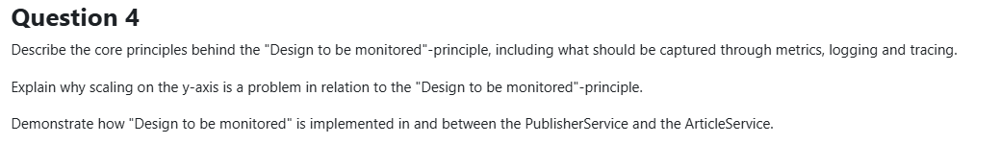

# Question 4: Design to be Monitored

## Part 1: Core Principles (Metrics, Logging, Tracing)

### What is "Design to be Monitored"?

Building observability into your system from day one. Making the system's internal behavior visible to understand what's happening, diagnose issues, and optimize performance.

**Analogy:** Like a car dashboard - you need gauges for speed, fuel, temperature. Without them, you're driving blind.

---

### The Three Pillars of Observability

### 1. **Metrics** - Numbers
Track numerical data over time: "How much?" and "How many?"

**Examples:**
- Response times (how fast?)
- Cache hit ratios (how efficient?)
- Error rates (how many failures?)
- CPU/memory usage

```csharp
// Example: Tracking cache performance
public async Task<double> GetHitRatio()
{
    var hits = await GetHitsAsync();
    var misses = await GetMissesAsync();
    return hits / (hits + misses);
}
```

### 2. **Logging** - Events
Record what happens and when: "What happened?" and "When?"

**Examples:**
- Article published
- Service started/stopped
- Errors with stack traces
- Important business events

```csharp
// Structured logging with context
MonitorService.Log.Information(
    "Cache hit for article {Id} (compressed: {Size} bytes)", 
    id, compressedBytes.Length);

MonitorService.Log.Error(ex, 
    "Failed to migrate {Region} database", region);
```

### 3. **Tracing** - Request Flow
Follow a request across services: "What's the path?" and "Where's the slowness?"

**Example:** User publishes article
- PublisherService receives POST (50ms)
- Publishes to RabbitMQ (20ms)
- ArticleService consumes message (100ms)
- Saves to database (80ms)
- **Total: 250ms** - you can see exactly where time is spent

```csharp
// Create a span to track an operation
using var activity = MonitorService.ActivitySource?.StartActivity("PublishArticle");
// Operation happens here
// Timing automatically recorded
```

---

## Part 2: Why Y-Axis Scaling Makes Monitoring Harder

**Y-axis scaling** = Functional decomposition = Splitting your app into multiple services (ArticleService, CommentService, etc.)

### The Problems

**Without microservices:** One service → Easy to monitor  
**With microservices:** 10 services → Much harder to see what's happening

#### Key Challenges:

1. **Requests Cross Multiple Services**
   - User action touches 5+ services
   - Without tracing, you can't follow the request path
   - Example: Publish article → PublisherService → RabbitMQ → ArticleService → 8 databases

2. **No Single Dashboard**
   - Each service has separate logs and metrics
   - Need centralized tools (Seq for logs, Zipkin for traces)
   - 10× more complex than a monolith

3. **Hard to Find Root Causes**
   - Service A slow because Service B is slow?
   - Or because database is slow?
   - Need tracing to see the whole chain

4. **More Things to Monitor**
   - Each service needs health checks
   - Each service needs metrics
   - Each service can fail independently

---

## Part 3: Implementation in PublisherService and ArticleService

### Setup: Shared Monitoring Service

Both services initialize monitoring on startup:

```csharp
// Every service does this
MonitorService.Initialize("ServiceName");

// Configures:
// - Zipkin for tracing (sees request flows)
// - Seq for logging (searchable logs)
// - Console for local debugging
```

### Example 1: Publishing an Article (Tracing)

**PublisherService:**
```csharp
public async Task<Article> PublishArticle(Article article)
{
    // Start tracking this operation
    using var activity = MonitorService.ActivitySource.StartActivity("PublishArticle");
    MonitorService.Log.Information("Publishing article");
    
    await _channel.BasicPublishAsync("articles.exchange", ...);
    
    return article;
    // Timing automatically recorded and sent to Zipkin
}
```

**ArticleService:**
```csharp
consumer.ReceivedAsync += async (_, ea) =>
{
    // Continue the trace from PublisherService
    using var activity = MonitorService.ActivitySource?.StartActivity();
    
    MonitorService.Log.Information("Received article: {Title}", article.Title);
    
    await dbContext.SaveChangesAsync();
    
    MonitorService.Log.Information("Saved article {Id} to database", article.Id);
};
```

**Result:** In Zipkin you see the complete flow with timing for each step.

### Example 2: Cache Metrics (Numbers)

```csharp
// ArticleAppService.cs - Track cache performance
public async Task<Article?> GetArticleAsync(int id, string region)
{
    // Try memory cache
    if (_memoryCache.TryGetValue(key, out Article? cached))
    {
        await _metrics.RecordHitAsync();  // Count as hit
        return cached;
    }
    
    // Try Redis
    var bytes = await _cache.GetAsync(key);
    if (bytes != null)
    {
        await _metrics.RecordHitAsync();  // Count as hit
        return Decompress(bytes);
    }
    
    // Database fallback
    await _metrics.RecordMissAsync();  // Count as miss
    return await _repo.GetArticleById(id, region);
}

// Check performance via API
[HttpGet("cache")]
public async Task<IActionResult> GetCacheMetrics()
{
    return Ok(new
    {
        HitRatio = await _metrics.GetHitRatio(),  // e.g., 0.73 (73%)
        Hits = await _metrics.GetHitsAsync(),      // e.g., 7300
        Misses = await _metrics.GetMissesAsync()   // e.g., 2700
    });
}
```

### Example 3: Retry Logging (Events)

```csharp
// Log every retry attempt with context
for (int attempt = 0; attempt < maxAttempts; attempt++)
{
    try
    {
        MonitorService.Log.Information(
            "Connecting to RabbitMQ (attempt {Attempt}/{Max})", 
            attempt + 1, maxAttempts);
        
        var connection = await factory.CreateConnectionAsync();
        return connection;
    }
    catch (Exception ex)
    {
        MonitorService.Log.Warning(ex, 
            "Connection failed (attempt {Attempt}); retrying...", attempt);
        await Task.Delay(delayMs);
    }
}
```

**In Seq:** Search `"RabbitMQ" AND @Level = "Warning"` to see all connection issues.

---

## The Tools

### Seq - For Logs
- **What:** Centralized log viewer
- **Access:** http://localhost:5342
- **Use:** Search logs by service, error level, or custom data
- **Example query:** `ServiceName = 'ArticleService' AND @Level = 'Error'`

### Zipkin - For Traces
- **What:** Shows request flows across services
- **Access:** http://localhost:9411
- **Use:** See which service is slow, visualize dependencies
- **Example:** Follow one request through 5 services and see timing for each

---

## Real Example: Publishing an Article

**What happens:**
1. PublisherService receives POST (50ms)
2. Publishes to RabbitMQ (20ms)
3. ArticleService consumes message (100ms)
4. Saves to database (80ms)

**In Zipkin:**
```
POST /api/publisher (250ms total)
  └─ PublishArticle (20ms)
      └─ ConsumeArticle (100ms)
          └─ SaveToDatabase (80ms)
```

You can see exactly where the time went!

---

## Summary

### What We Implemented:

✅ **Metrics:** Cache hit ratios via HTTP endpoint  
✅ **Logging:** Structured logs → Seq for searching  
✅ **Tracing:** Request flows → Zipkin for visualization  

### Why It Matters:

**Without monitoring:**
- Service fails → You don't know why
- System slow → You don't know which service
- Bug in production → Hard to debug

**With monitoring:**
- See exactly what's failing
- Know which service is slow
- Search logs to find issues
- Follow requests across services

**Key insight:** In microservices, monitoring isn't optional - it's survival. With 10 services, you MUST have visibility or you're blind.

