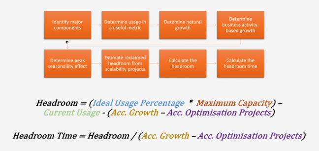

### Spørgsmål 1: Asynkron design 

Beskriv problemstilling som asynkront design kan hjælpe med at løse. 

Demonstrer at asynkron kode har en positiv effekt på performance. 

Vurder hvilke kompromiser der opstår mellem kompleksitet og performance når dette princip benyttes.

### Spørgsmål 2: Fault isolation 

Beskriv principperne for fault isolation.
 
Demonstrer hvordan circuit breakers kan bruges til at isolere fejl i en microservice-arkitektur. 

Sammenlign forskellige resilience patterns (retry, fallback, circuit-breaker etc.) i relation til availability. 

### Spørgsmål 3: Skaleringskuben 

Forklar hvordan headroom-beregninger kan hjælpe med kapacitetsplanlægning. 

Konstruer et eksempel, hvor en kombination af to akser løser et konkret skaleringsproblem. 

Vurder hvilke kompromiser der opstår ved at vælge z-akse-skalering i et system, der oprindeligt er designet til monolitisk datalagring. 

### Spørgsmål 4: Green Architecture Framework 

Forklar hovedprincipperne bag Green Architecture Framework (GAF). 

Demonstrer udvalgte taktikker fra GAF med før- og efter-eksempler. 

Diskuter hvordan GAF kan bidrag til forbedret skalerbarhed. 

### Spørgsmål 5: Automation og DevOps 

Forklar hvorfor principper "Automation over people" befinder sig midt i Venn-diagrammet for skaleringsprincipper. 

Vis en pipeline, der eliminere manuelle steps fra deployment-workflowet. 

Relater brugen af DevOps-principper til forskellige virksomhedsbrancher. 

### Spørgsmål 6: Recovery 

Forklar hvilke muligheder feature flags giver i deployment-processen. 

Skitser en fremgangsmåde til implementering af rollback mekanismer i en CI/CD-pipeline. 

Sammenlign principperne "Design to be disabled" og "Design for rollback" med fokus på hvor de hver især kan anvendes. 

### Spørgsmål 7: Specifikationer 

Forklar forskellen på formelle og uformelle specifikationer i forbindelse med outsourcing. 

Udarbejd et eksempel på en formel specifikation for en mindre funktion, der skal outsources. 

Sammenlign din formelle specifikation med en uformel version, og vurder fordele og ulemper. 

### 8: Design to be monitored 

Beskriv "Design to be monitored"-princippet, herunder forskellen på metrics, logging og tracing. 

Demonstrer hvorfor skalering på y-aksen skaber problemer for monitorerings-princippet. 

Vurder hvilke data i logs og traces, der kan udgøre nyttige metrics for overvågning af et distribueret system. 

### Spørgsmål 9: Organisatorisk skalering 

Beskriv potentielle udfordringer, der kan opstå når et udviklingsteam vokser fra en lille gruppe til en stor organisation. 

Opstil en risiko-analyse for en organisation, der planlægger at skifte fra Scrum til en skaleret version (eks. SASS, LESS, SaFE, Spotify, etc.). 

Skitser hvordan risikoanalysen kan bruges til at træffe en go/no-go beslutning om implementering af forandringen. 

### Spørgsmål 10: Availability 

Forklar begrebet availability og hvordan det relaterer sig til skaleringsprincipper og skaleringskuben. 

Vis eksempler på mekanismer til forbedring af availability i et system der presses af stigende traffik. 

Diskuter hvordan visse arkitektoniske valg kan have en negativ indvirkning på systemets availability. 

### Spørgsmål 11: Time to market 

Forklar begrebet time to market og hvordan det relaterer sig til skalerings-principper og skaleringskuben. 

Vis eksempler på mekanismer til at forbedre time to market i et system. 

Diskuter hvordan visse arkitektoniske valg kan have en negativ indvirkning på systemets time to market. 

### Spørgsmål 12: Virtualisering 

Forklar forskellen på virtualisering gennem virtuelle maskiner og containers. 

Demonstrer hvordan Docker kan bruges til at skabe et konsistent udviklings- og produktionsmiljø. 

Diskuter fordele og ulemper ved at bruge Docker i en stor skalerbar applikation. 
